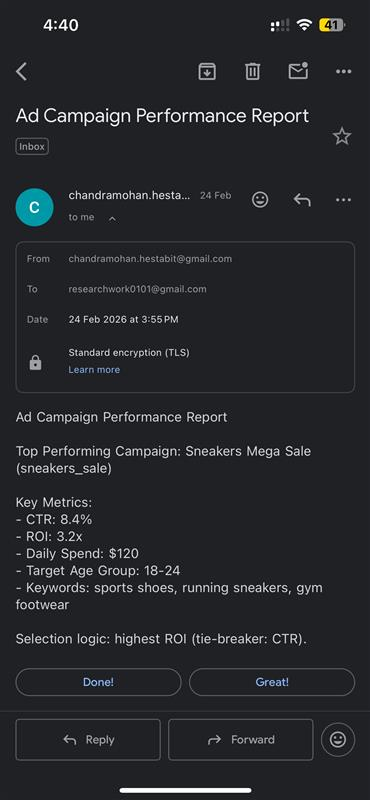
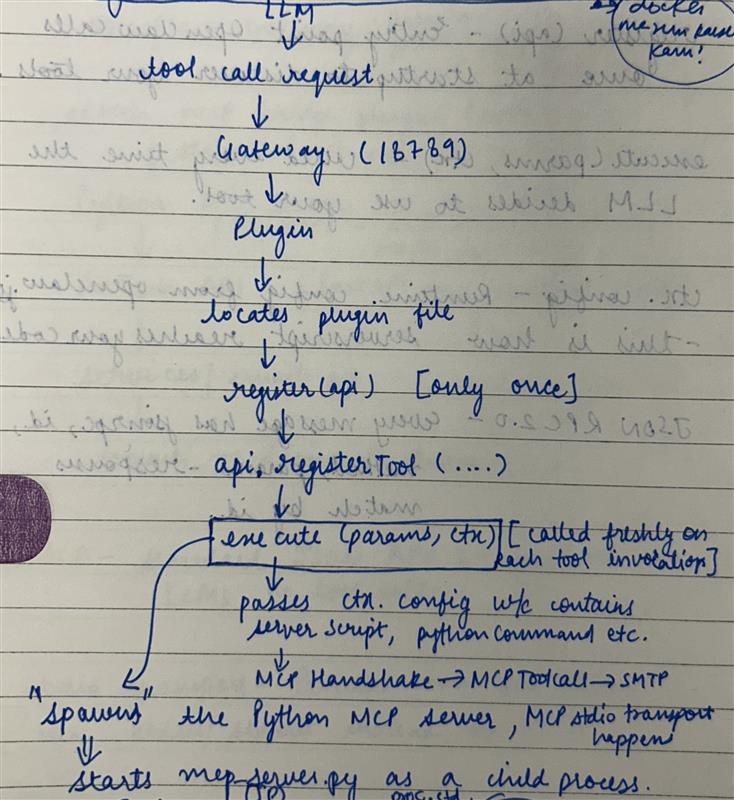

# AdTech MCP Bridge

An OpenClaw plugin that connects an AI agent to an AdTech backend via MCP (Model Context Protocol). The agent can fetch top campaign metrics and email formatted reports on demand.

## How It Works

```
OpenClaw Agent (TUI)
       │
       ▼
openclaw gateway : openclaw llm (gpt 5.3 codex ) => decides which tool matches the intent? adtech_email_top_campaign_report 
       │
       ▼
adtech-mcp-bridge (index.ts) => runs execute() which validates config and spawns mcp_server.py
       │  stdin/stdout pipes (JSON RPC 2.0)
       ▼
mcp_tools/mcp_server.py (Python MCP server initialise handshake, routes tool calls)- via stdio
       │  calls AdTech APIs 
       ▼
ad_server/app.py (FastAPI Backend — http://localhost:8000)
       │
       ├─ campaign data   →  ad_server/data.py
       └─ email sending   →  services/email.py  (SMTP)
```

## Project Structure

```
openclawAdtech/
├── ad_server/
│   ├── app.py              # FastAPI backend (campaign APIs)
│   └── data.py             # Campaign data / mock DB
├── adtech-mcp-bridge/
│   ├── index.ts            # OpenClaw plugin entry point
│   ├── openclaw.plugin.json
│   ├── package.json
│   ├── tsconfig.json
│   └── TEST_FLOW.md
├── mcp_tools/
│   └── mcp_server.py       # Python MCP server
├── services/
│   └── email.py            # SMTP email service
├── venv/                   # Python virtual environment
├── .env                    # Local (not committed)
├── .gitignore
├── package.json
├── requirements.txt
└── README.md
```

## Prerequisites

- Node.js v18+
- Python 3.10+
- OpenClaw CLI installed
- A Gmail app password for SMTP

## Setup

### 1. Clone and install

```bash
git clone <repo-url>
cd openclawAdtech

# Python dependencies
python3 -m venv venv
source venv/bin/activate
pip install -r requirements.txt

# Plugin dependencies
cd adtech-mcp-bridge && npm install && npm run build && cd ..
```

### 2. Configure environment

```bash
cp .env.example .env
# Edit .env with your values
```

**.env values needed**
```
SMTP_HOST=smtp.gmail.com
SMTP_PORT=587
SMTP_USER=you@gmail.com
SMTP_PASS=your-gmail-app-password
EMAIL_FROM=you@gmail.com
API_BASE_URL=http://localhost:8000
```

### 3. Register plugin with OpenClaw

```bash
openclaw config set --strict-json plugins.entries.adtech-mcp-bridge '{
  "enabled": true,
  "config": {
    "serverScript": "/absolute/path/to/openclawAdtech/mcp_tools/mcp_server.py",
    "pythonCommand": "/absolute/path/to/openclawAdtech/venv/bin/python3",
    "apiBaseUrl": "http://localhost:8000",
    "requestTimeoutMs": 45000
  }
}'
```

## Running

```bash
# Terminal 1 — Start FastAPI backend
source venv/bin/activate
uvicorn ad_server.app:app --reload --port 8000

# Terminal 2 — Start OpenClaw gateway and TUI
openclaw gateway restart
openclaw tui
```

## Usage

In the OpenClaw TUI, type:

generate a report of top performing campaigns and send to you@gmail.com

The agent fetches campaign metrics from the FastAPI backend via the MCP server and emails a formatted report using the SMTP email service.



